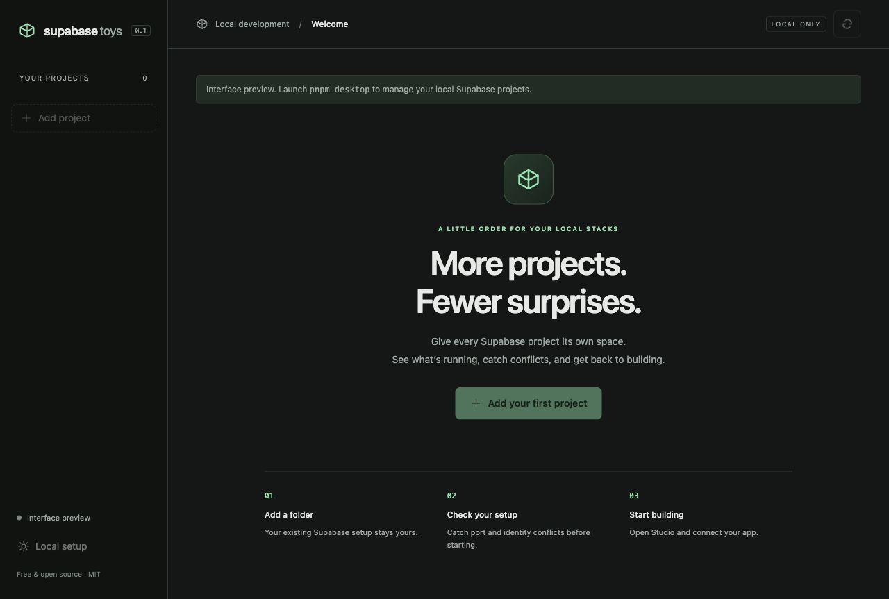

# Supabase Toys

Run several local Supabase projects. Catch conflicts before starting. Understand failures without disrupting another project.

A free, MIT-licensed Go/Wails desktop app and standalone Go CLI. All project management happens on your machine. No Toys account, hosted backend, telemetry, or automatic updates. Optional Supabase account profiles connect directly to the Management API for read-only cloud inventory.



## What you can do

- Register existing project folders and discover other Supabase containers.
- Start, stop, and restart a selected project while preserving its data.
- Diagnose duplicate IDs, occupied/reserved ports, missing tools, and unhealthy services.
- Review port repairs before applying them, with config backups and stale-preview checks.
- Change an unused project ID only after verifying that neither identity owns containers, volumes, or networks.
- Open Studio and the email inbox; copy runtime connections; preview environment exports.
- View redacted service logs and project-scoped CPU/RAM, including unavailable/partial readings.
- Export redacted diagnostic reports for troubleshooting.

Standard Supabase CLI projects are the default. Existing experimental **Docker** stacks can be explicitly registered by full stack ID. Toys does not migrate standard database data to experimental stacks.

## Run from source

Requirements: Go 1.27.1, Node.js 24, pnpm 10.34.5, and the [Wails platform prerequisites](https://v2.wails.io/docs/gettingstarted/installation/). Project management also requires local Docker and **Supabase CLI 2.119.0 or 2.118.0**. Tools are never silently installed or upgraded.

```sh
pnpm install --frozen-lockfile
pnpm cli:build
pnpm desktop
```

`pnpm desktop:build` creates a native app under `build/bin`. On Linux, build with `node scripts/go.mjs tool wails build -m -nosyncgomod -tags desktop,webkit2_41`. Go dependencies and the Wails build tool are pinned in `go.mod`/`go.sum`; there is no Rust toolchain requirement.

`pnpm dev` opens the interface preview in a browser. Native actions are disabled there; use `pnpm desktop` for the functional Go/Wails app.

If Supabase is installed inside a project rather than on PATH, select its absolute executable path in **Local setup** or use:

```sh
build/bin/supabase-toys settings --supabase-cli /absolute/path/to/supabase
```

The desktop app and CLI share the same registry in the OS local application-data directory under `supabase-toys`. CLI `--data-dir` and desktop `TOYS_DATA_DIR` can select an isolated registry for testing.

## CLI quick start

```sh
supabase-toys project add /path/to/project-a --name A
supabase-toys project add /path/to/project-b --name B
supabase-toys project list
supabase-toys doctor B
supabase-toys doctor B --preview --save ./b-ports.json
# Review b-ports.json, then apply it:
supabase-toys doctor B --apply ./b-ports.json
supabase-toys start A
supabase-toys start B
supabase-toys status B --resources
supabase-toys logs B --follow
supabase-toys env B --map API_URL=VITE_SUPABASE_URL --map ANON_KEY=VITE_SUPABASE_ANON_KEY
# Explicitly write the mapped variables after reviewing the preview:
supabase-toys env B --map API_URL=VITE_SUPABASE_URL --map ANON_KEY=VITE_SUPABASE_ANON_KEY --write
supabase-toys diagnostics export B --include-logs --output ./b-diagnostics.json
supabase-toys stop B
```

Use `--restart` when applying a repair to a running project. This restarts only that project. Duplicate names require project IDs from `project list`.

All commands accept `--json`; progress and errors go to stderr, final structured results to stdout. `logs --follow --json` emits newline-delimited log batches. Follow mode polls recent Docker logs every two seconds and may repeat boundary lines. Output buffers and per-service history are bounded.

Environment previews hide credentials by default; `--show-secrets` explicitly reveals them. Privileged keys, credential-bearing database URLs, and service-role JWTs cannot be mapped to browser-exposed variables. Environment writes preserve unrelated settings, reject duplicate target assignments, and back up existing files.

Removing a registration leaves configuration, containers, and data intact. V1 has no global stop, reset, destroy, or volume-delete command.

For a verified unused setup:

```sh
supabase-toys project identity-preview B project-b-unique --save ./b-identity.json
# Review the proposed ID, then apply:
supabase-toys project identity-apply ./b-identity.json
```

For an already-created experimental Docker stack:

```sh
SUPABASE_EXPERIMENTAL_STACK=1 supabase stack list --output-format json
supabase-toys project add /path/to/project --stack-id FULL_STACK_ID
```

See [architecture and safety](docs/architecture.md), [validation](docs/validation.md), and [release preparation](docs/releases.md).

## Download and terminal installation

The release workflow produces macOS DMG, Windows NSIS, Linux AppImage/DEB, and standalone CLI archives. End users need no Go or Node.js installation. Supabase CLI and Docker remain prerequisites.

**Release artifacts are not published yet.** After publishing this repository and a release, replace `OWNER/REPO` with the repository identity. Download the installer from that release and run:

```sh
sh install.sh --repo OWNER/REPO --version v0.1.0
```

```powershell
./install.ps1 -Repository OWNER/REPO -Version v0.1.0
```

Installers verify archive SHA-256 checksums before installing. They do not change PATH automatically. Defaults: `~/.local/bin` on macOS/Linux and `%LOCALAPPDATA%\SupabaseToys\bin` on Windows.

Desktop targets: macOS 13+ Intel/Apple silicon, Windows x64, Linux x64. CLI also supports Linux arm64. Linux release binaries are built on Ubuntu 24.04; desktop requires the WebKitGTK 4.1 runtime. Windows desktop requires WebView2.

Supabase Toys is an independent community tool and is not affiliated with or endorsed by Supabase.


### Change project ports

Overview shows every enabled, supported host port, including the shadow database port, while the project is running or stopped. Choose **Change ports → Review changes → Apply**. Running projects require **Apply & restart project**. Only the selected project restarts; configurations are backed up, comments are preserved, and other projects’ allocations and host listeners are checked again before writing. Experimental stacks continue to allocate their own ports.

```sh
build/bin/supabase-toys --json ports list PROJECT
build/bin/supabase-toys --json ports preview PROJECT --set api.port=55000 > ports.json
build/bin/supabase-toys --json ports apply ports.json --restart
```

After changing ports, review connection settings and preview any app environment updates.

### Graphify for contributors

Graphify is an optional development tool, independent of the shipped desktop and CLI. Install the tested `graphifyy==0.9.46` with `uv tool install graphifyy==0.9.46`, then run `pnpm graph:update` to create the local AST graph. `pnpm graph:report` creates a report and interactive graph with local clustering and no LLM labeling. Use `graphify affected PlanPortChanges --depth 2` or `graphify query "port editing"` for change-impact navigation. The generated `graphify-out/` directory is ignored.

Codex guidance is in `AGENTS.md`. `graphify codex install` sets up a local hook; the installed version intentionally uses a no-op hook in Codex Desktop, so guidance comes from that file. Graphs aid navigation and do not replace source inspection or tests. The JSON Docker fixture produces no symbols; references to dependencies may point outside this repository.

## Multiple Supabase accounts

Use **Connect account** to add a named profile with a scoped personal access token. Grant **Organizations: Read** and **Organization Projects: Read** for the resources you want to browse. Tokens may show only a subset of your account; profile labels are not verified user identities.

Tokens are saved in macOS Keychain, Windows Credential Manager, or Linux Secret Service. If that store is locked or unavailable, unlock/configure it or explicitly choose **session only**. No plaintext fallback is used. Linux requires a running Secret Service with an unlocked default collection. Session profiles and tokens disappear when Toys closes.

The sidebar groups profiles → organizations → hosted projects → associated local environments. Hosted details show region, reported status, last refresh, and Open Dashboard. Cloud inventory is read-only; start/stop/restart, ports, logs, and resources remain local actions. Refresh is manual; cached readings become stale after five minutes or immediately after a failed refresh. Failed access retains the last successful inventory with an actionable access state.

From either a hosted project or local environment, choose **Associate** and confirm the target. Existing `supabase/.temp/project-ref` links can suggest exact matches, but suggestions never apply automatically. Associations are stored by hosted reference, so shared projects appear consistently under multiple profiles. Association does not run `supabase link`, edit config/env files, or copy database data. Inaccessible associations remain available in the ungrouped local list.

```sh
supabase-toys account add Personal
# Enter a scoped token at the hidden interactive prompt, not in command arguments.
supabase-toys account list --json
supabase-toys cloud list --account Personal --refresh --json
supabase-toys project associate LOCAL --account Personal --cloud-ref PROJECT_REF
supabase-toys project association-suggestions LOCAL
supabase-toys project unassociate LOCAL
supabase-toys account remove Personal
```

The CLI requires a terminal for token entry; piped input and token flags are not supported. `account add --session-only` validates and displays inventory for that invocation only; use desktop session profiles for ongoing session-only work. Saved profiles and associations are shared across desktop and CLI without changing Supabase CLI login.

Disconnect removes the local credential and cache, preserving local registrations and associations. Revoke unused tokens separately in [Supabase account settings](https://supabase.com/dashboard/account/tokens). Inventory output never includes project API keys or database passwords. JSON consumers should inspect `stale`, `access_state`, and `message` after refresh: API failures return cached data rather than an empty successful inventory.

Credential-store integration tests use synthetic temporary values only:

```sh
TOYS_KEYRING_TEST=1 go test -tags credentialintegration ./pkg/engine -run TestSystemCredentialStoreRoundTrip
```

On Windows set `TOYS_KEYRING_TEST=1` in the environment before running the same Go test. Linux requires an unlocked Secret Service; CI provisions an isolated D-Bus session.
